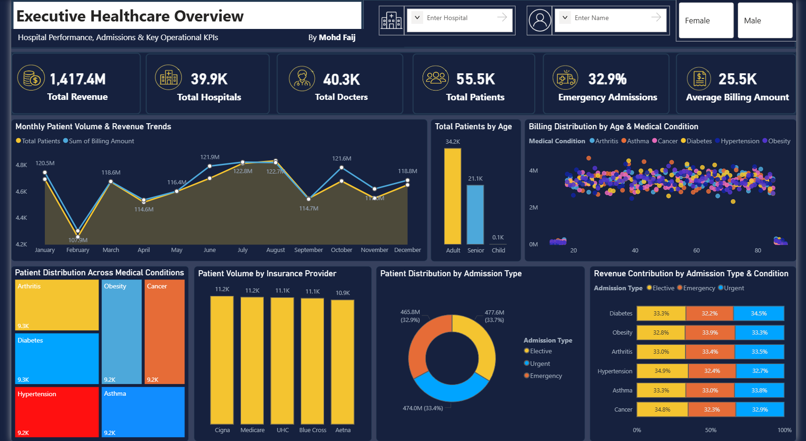
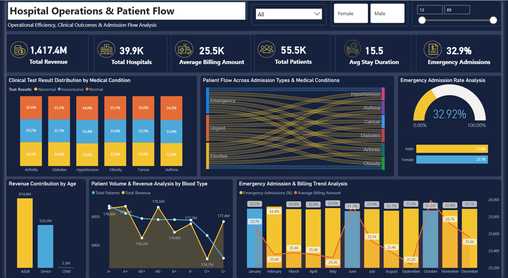
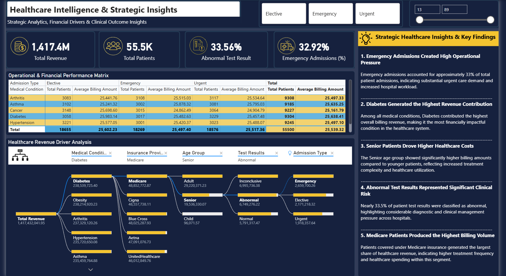

# 🏥 Healthcare Operations & Patient Flow Analytics

<div align="center">


**An end-to-end healthcare analytics system transforming 55,500+ raw patient records into executive-ready decisions — built with Power BI, SQL, and Python.**

[📊 View Dashboards](#-dashboard-modules) · [🔍 SQL Analysis](#-sql-analysis) · [📈 Key Findings](#-key-findings) · [🚀 Getting Started](#-getting-started)

</div>

---

## 📌 Table of Contents

- [Project Overview](#-project-overview)
- [The Problem This Solves](#-the-problem-this-solves)
- [Project Architecture](#-project-architecture)
- [Dashboard Modules](#-dashboard-modules)
- [Key Findings](#-key-findings)
- [SQL Analysis](#-sql-analysis)
- [Python Analysis](#-python-analysis)
- [Tech Stack](#-tech-stack)
- [Project Deliverables](#-project-deliverables)
- [Dataset](#-dataset)
- [Getting Started](#-getting-started)
- [Author](#-author)

---

## 🎯 Project Overview

Most hospitals are drowning in data but starving for decisions.

This project builds a **complete end-to-end Healthcare Analytics System** — from raw, unstructured patient records to fully interactive executive dashboards — enabling hospital administrators and clinical leaders to identify revenue drivers, monitor patient flow, and act on clinical risk signals in real time.

| Metric | Value |
|---|---|
| 📋 Total Patient Records Analyzed | 55,500+ |
| 🏥 Hospitals Covered | 39,900+ |
| 👨‍⚕️ Total Doctors | 40,300+ |
| 💰 Total Revenue Analyzed | ₹1,417.4M |
| 📊 Dashboard Pages | 3 Interactive Modules |
| 📄 Analytical Report Pages | 8 Pages |
| 🔍 SQL Query Categories | 8 Categories |

---

## 🔴 The Problem This Solves

Healthcare organizations generate enormous volumes of data across admissions, billing, diagnostics, and patient demographics — but this data is siloed, unstructured, and rarely translated into actionable insights for leadership.

**Key questions that went unanswered before this system:**

- Which medical conditions are driving the most revenue — and why?
- Are emergency admissions creating disproportionate operational pressure?
- What percentage of clinical test results represent active risk?
- Which patient segments cost the most to treat per visit?
- How are insurance providers performing in terms of billing volume?

> **This project answers all of them — with data, not assumptions.**

---

## 🏗 Project Architecture

```
Raw Patient Data (55,500+ records)
        │
        ▼
┌─────────────────┐
│   Python Layer  │  ← Data Cleaning, Processing & Statistical Analysis
└────────┬────────┘
         │
         ▼
┌─────────────────┐
│   SQL Layer     │  ← 8-Category Query Analysis & KPI Extraction
└────────┬────────┘
         │
         ▼
┌─────────────────┐
│  Data Model     │  ← Relationships, DAX Measures & Calculated Columns
└────────┬────────┘
         │
         ▼
┌──────────────────────────────────────────┐
│           Power BI Dashboards            │
│  ┌────────────┐ ┌──────────┐ ┌────────┐ │
│  │ Executive  │ │Operations│ │ Intel  │ │
│  │ Overview   │ │& Patient │ │& Strat │ │
│  │            │ │  Flow    │ │Insights│ │
│  └────────────┘ └──────────┘ └────────┘ │
└──────────────────────────────────────────┘
         │
         ▼
┌─────────────────┐
│  8-Page         │  ← Executive Analytical Report
│  Analytical     │
│  Report         │
└─────────────────┘
```

---

## 📊 Dashboard Modules

### Module 1 — Executive Healthcare Overview

> *"What is the overall performance of our hospital network?"*
<div align="center">



</div>
The top-level command center for leadership — designed to be read and acted upon in under 30 seconds.

**KPIs Tracked:**
- Total Revenue: ₹1,417.4M
- Total Hospitals: 39,900
- Total Doctors: 40,300
- Total Patients: 55,500
- Emergency Admissions Rate: 32.9%
- Average Billing Amount: ₹25,500

**Visuals Included:**
- 📈 Monthly Patient Volume & Revenue Trends (dual-axis line chart)
- 🗂 Patient Distribution Across Medical Conditions (treemap)
- 🏦 Patient Volume by Insurance Provider (bar chart)
- 🍩 Patient Distribution by Admission Type (donut chart)
- 🌡 Billing Distribution by Age & Medical Condition (scatter plot)
- 📊 Revenue Contribution by Admission Type & Condition (stacked bar)

---

### Module 2 — Hospital Operations & Patient Flow

> *"Where are the bottlenecks, and how is patient flow moving through the system?"*
<div align="center">



</div>
The operational engine room — built for hospital operations managers and clinical directors.

**KPIs Tracked:**
- Average Stay Duration: 15.5 days
- Emergency Admission Rate: 32.92%
- Average Billing Amount: ₹25,500
- Gender Split: Male 27.8K | Female 27.7K

**Visuals Included:**
- 🔀 Sankey Diagram — Patient Flow Across Admission Types & Medical Conditions
- 📊 Clinical Test Result Distribution by Medical Condition (stacked bar)
- 🚨 Emergency Admission Rate Analysis (gauge + gender breakdown)
- 💰 Revenue Contribution by Age Group (bar chart)
- 🩸 Patient Volume & Revenue by Blood Type (dual-axis)
- 📅 Emergency Admission & Billing Trend Analysis (monthly, 12-month view)

---

### Module 3 — Healthcare Intelligence & Strategic Insights

> *"What are the real revenue drivers, and what strategic decisions should we make?"*
<div align="center">



</div>
The intelligence layer — built for C-suite strategic planning and performance reviews.

**KPIs Tracked:**
- Total Revenue: ₹1,417.4M
- Total Patients: 55,500
- Abnormal Test Result Rate: 33.56%
- Emergency Admissions Rate: 32.92%

**Visuals Included:**
- 🌳 Decomposition Tree — Revenue Driver Analysis (Medical Condition → Insurance → Age → Test Result → Admission Type)
- 📋 Operational & Financial Performance Matrix (cross-tab: condition × admission type)
- 📌 Strategic Healthcare Insights Panel (5 key findings with business context)

---

## 📈 Key Findings

These are not assumptions — every finding is extracted directly from the data:

### 1. 🚨 Emergency Admissions Created High Operational Pressure
> **32.92%** of all patient admissions were emergency cases — nearly 1 in 3 — indicating substantial urgent care demand and sustained pressure on hospital capacity and resources.

### 2. 💰 Diabetes Generated the Highest Revenue Contribution
> Among all 6 medical conditions analyzed, **Diabetes** contributed the highest overall billing revenue at **₹238.5M**, making it the most financially impactful condition in the system.

### 3. 👴 Senior Patients Drove Higher Healthcare Costs
> While **Adult patients** contributed more total revenue (₹874.8M vs ₹539.3M for seniors), **Senior patients** showed significantly higher billing amounts per visit — reflecting increased treatment complexity and healthcare utilization.

### 4. ⚠️ Abnormal Test Results Represented Significant Clinical Risk
> **33.56%** of all patient test results were classified as abnormal — nearly 1 in 3 — highlighting considerable diagnostic and clinical management pressure spread across all 6 conditions.

### 5. 🏦 Medicare Patients Produced the Highest Billing Volume
> Patients covered under **Medicare insurance** generated the largest share of healthcare revenue — indicating higher treatment frequency and spending within this segment compared to Cigna, Blue Cross, Aetna, and UHC.

### 6. 🔁 The 33/33/33 Triage Pattern
> Emergency, Elective, and Urgent admissions split **almost perfectly one-third each** across every single medical condition. This uniform distribution is statistically unusual and points to a **systemic triage pattern** that warrants clinical investigation.

---

## 🔍 SQL Analysis

The SQL layer covers **8 analysis categories** forming the analytical backbone of the project:

```sql
-- Category 1: Revenue Analysis
-- Total revenue by medical condition, insurance provider, admission type

-- Category 2: Patient Admission Analysis  
-- Volume trends, admission type breakdown, monthly patterns

-- Category 3: Emergency Admission Tracking
-- Emergency rate by condition, hospital, gender, and month

-- Category 4: Medical Condition Segmentation
-- Patient distribution, avg billing, length of stay per condition

-- Category 5: Billing Analysis
-- Avg billing by age group, blood type, admission type, insurance

-- Category 6: Age Group & Gender Analysis
-- Revenue contribution, test results, admission patterns by demographics

-- Category 7: Clinical Test Result Analysis
-- Abnormal/Normal/Inconclusive breakdown by condition and admission type

-- Category 8: Operational KPI Extraction
-- Avg stay duration, doctor-patient ratios, hospital-level performance
```

> 📁 Full SQL scripts available in the `/SQL` folder of this repository.

---

## 🐍 Python Analysis

Python was used for the data preparation and statistical layer:

```python
# Key operations performed:
# ✔ Data ingestion and initial profiling
# ✔ Null value handling and imputation
# ✔ Outlier detection and treatment
# ✔ Feature engineering (age groups, billing bands, stay duration categories)
# ✔ Statistical summary generation
# ✔ Data export pipeline for Power BI ingestion
```

> 📁 Full Python scripts available in the `/Python` folder of this repository.

---

## 🛠 Tech Stack

| Tool | Purpose |
|---|---|
| **Power BI Desktop** | Dashboard development, interactive visualizations |
| **DAX** | KPI measures, calculated columns, dynamic filtering |
| **SQL** | Data extraction, transformation, and analysis queries |
| **Python (pandas, numpy, matplotlib)** | Data cleaning, processing, statistical analysis |
| **Data Modeling** | Star schema design, table relationships, cardinality management |

---

## 📦 Project Deliverables

```
📁 Healthcare-Analytics/
│
├── 📊 Dashboards/
│   ├── Executive_Healthcare_Overview.pbix
│   ├── Hospital_Operations_Patient_Flow.pbix
│   └── Healthcare_Intelligence_Strategic_Insights.pbix
│
├── 🖼 Dashboard_Screenshots/
│   ├── Executive_Overview.png
│   ├── Flow_Analysis.png
│   └── Insights_Strategies.png
│
├── 🔍 SQL/
│   ├── 01_Revenue_Analysis.sql
│   ├── 02_Patient_Admission_Analysis.sql
│   ├── 03_Emergency_Tracking.sql
│   ├── 04_Medical_Condition_Segmentation.sql
│   ├── 05_Billing_Analysis.sql
│   ├── 06_Demographics_Analysis.sql
│   ├── 07_Clinical_Test_Results.sql
│   └── 08_Operational_KPIs.sql
│
├── 🐍 Python/
│   ├── data_cleaning.py
│   ├── eda_analysis.py
│   └── feature_engineering.py
│
├── 📄 Report/
│   └── Healthcare_Analytics_Report_8Page.pdf
│
└── 📋 README.md
```

---

## 📂 Dataset

| Property | Details |
|---|---|
| Records | 55,500+ patient entries |
| Hospitals | 39,900+ facilities |
| Medical Conditions | Arthritis, Asthma, Cancer, Diabetes, Hypertension, Obesity |
| Admission Types | Emergency, Elective, Urgent |
| Insurance Providers | Cigna, Medicare, UHC, Blue Cross, Aetna |
| Age Groups | Adult, Senior, Child |
| Blood Types | A+, A−, B+, B−, AB+, AB−, O+, O− |
| Time Period | Full 12-month calendar year |

---

## 🚀 Getting Started

### Prerequisites
- Power BI Desktop (latest version)
- SQL Server / MySQL / PostgreSQL
- Python 3.8+

### Installation

```bash
# 1. Clone the repository
git clone https://github.com/MohdFaij/healthcare-analytics.git

# 2. Navigate to project directory
cd healthcare-analytics

# 3. Install Python dependencies
pip install pandas numpy matplotlib seaborn sqlalchemy

# 4. Run data cleaning script
python Python/data_cleaning.py

# 5. Execute SQL scripts in order (01 → 08)
# Open your SQL client and run scripts from the /SQL folder

# 6. Open the Power BI file
# Launch Power BI Desktop → Open File → Select .pbix from /Dashboards folder
```

---

## 👨‍💻 Author

<div align="center">

**Mohd Faij**

*Data Analyst | Power BI Developer | Healthcare Analytics*

[](https://linkedin.com/in/mohdFaij)
[](https://github.com/MohdFaij)

</div>

---

<div align="center">

**If this project helped you or inspired your own work, please consider giving it a ⭐**

*Built with purpose. Designed for decisions. Powered by data.*

</div>
